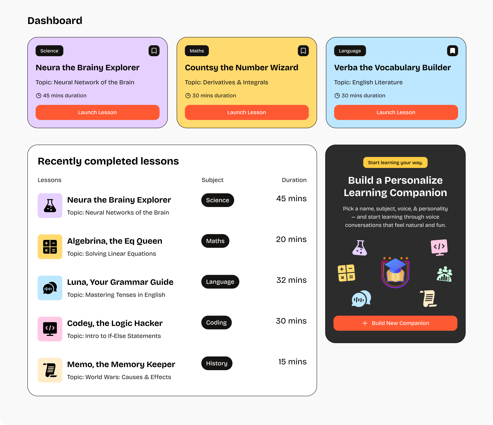

# 🎓 Tutora — Real-Time AI Teaching Platform

<p align="center">
  
</p>

Tutora is a state-of-the-art, real-time AI-powered voice tutoring platform. It empowers students to build custom AI learning companions tailored to specific academic subjects, topic depths, speaking voices, and conversational styles. Through natural, low-latency WebRTC voice streams, Tutora simulates one-on-one personal tutoring, making learning interactive, accessible, and highly personalized.

---

## 📌 Table of Contents

- [🌟 Core Features](#-core-features)
- [🛠️ Tech Stack & Dependencies](#-tech-stack--dependencies)
- [🗄️ Database Setup (Supabase)](#-database-setup-supabase)
- [⚙️ Environment Variables Setup](#-environment-variables-setup)
- [🚀 Getting Started](#-getting-started)
- [📂 Directory Structure](#-directory-structure)
- [License](#license)
- [Author](#author)

---

## 🌟 Core Features

- **🔐 Secured Authentication & User Profiles**: Power-packed user login and registration powered by **Clerk Auth**, mapping custom authentication tokens into database transactions.
- **🎙️ Real-Time Voice Sessions**: Live conversations streaming audio directly over WebRTC. Managed by the **Vapi AI Web SDK**, configured using OpenAI GPT-4, ElevenLabs for voice synthesis, and Deepgram for fast transcription.
- **✨ Animated Audio Visualizer**: A custom **Lottie-based soundwave animation** that triggers dynamically during voice synthesis, providing immediate visual feedback when the tutor is speaking.
- **📝 Real-Time Chat Transcript**: Live-updated, scrollable transcription lists that capture and partition dialogue between the tutor and the student.
- **🛠️ Custom Companion Builder**: A comprehensive creation wizard powered by **React Hook Form** and **Zod** validation. Users can configure:
  - **Companion Name**: Define the personality.
  - **Subject Category**: Select from `Maths`, `Language`, `Science`, `History`, `Coding`, or `Economics`.
  - **Topic details**: Define exactly what the companion should guide them through (e.g. *Derivatives & Integrals*, *World Wars*).
  - **Voice & Tone Style**: Toggle between `Male` or `Female` voice engines, and `Casual` or `Formal` speaking styles.
  - **Session Duration**: Define targeted minutes for the lesson.
- **📌 Journey Dashboard & Bookmarks**: A profile space listing user stats (completed lessons, built companions) and interactive accordions tracking:
  - **Bookmarked Companions** (with add/remove triggers using Next.js cache revalidation).
  - **Recent Sessions History** (updated in real-time on session start).
  - **My Companions** (a history of custom-built tutors).
- **💳 Pricing & Subscription Tiers**: An integrated Clerk-based upgrade model (`<PricingTable />`) checking feature flags (`pro` unlimited, `3_companion_limit`, or `10_companion_limit`) to govern builder controls.
- **🚨 Bulletproof Error Monitoring**: Deep-seated implementation of **Sentry SDK** across Edge runtimes, client layouts, and Node servers, tracking errors and performance analytics instantly.

---

## 🛠️ Tech Stack & Dependencies

- **Framework**: [Next.js 15.5.4](https://nextjs.org/) (App Router, Server Actions, React 19)
- **Styling**: [Tailwind CSS v4.0](https://tailwindcss.com/) & [Vanilla CSS variables](app/globals.css) (with `@theme` directives)
- **Voice AI**: [@vapi-ai/web](https://vapi.ai) (WebRTC streaming, Deepgram, ElevenLabs, OpenAI GPT-4)
- **Database**: [@supabase/supabase-js](https://supabase.com/) (Clerk JWT-based Row Level Security)
- **Auth & Billing**: [@clerk/nextjs](https://clerk.com/) (Authentication, Profile Management, Pricing Tables)
- **Form Handling**: `react-hook-form` + `@hookform/resolvers` + `zod`
- **Animations**: `lottie-react` (interactive SVG soundwave animations)
- **Monitoring**: `@sentry/nextjs` (Edge, client, server analytics)
- **Icons & Helpers**: `lucide-react` and `@jsmastery/utils`

---

## 🗄️ Database Setup (Supabase)

To link your database tables with Clerk users securely, set up the following schema in your Supabase SQL Editor. The application maps Clerk `userId` values directly to target foreign keys.

```sql
-- 1. Enable UUID Extension
CREATE EXTENSION IF NOT EXISTS "uuid-ossp";

-- 2. Create Companions Table
CREATE TABLE IF NOT EXISTS companions (
    id UUID PRIMARY KEY DEFAULT gen_random_uuid(),
    name VARCHAR(255) NOT NULL,
    subject VARCHAR(50) NOT NULL,
    topic TEXT NOT NULL,
    voice VARCHAR(50) NOT NULL,
    style VARCHAR(50) NOT NULL,
    duration INTEGER NOT NULL,
    author VARCHAR(255) NOT NULL, -- Maps to Clerk user_id
    created_at TIMESTAMPTZ DEFAULT NOW()
);

-- 3. Create Session History Table
CREATE TABLE IF NOT EXISTS session_history (
    id BIGSERIAL PRIMARY KEY,
    companion_id UUID NOT NULL REFERENCES companions(id) ON DELETE CASCADE,
    user_id VARCHAR(255) NOT NULL, -- Maps to Clerk user_id
    updated_at TIMESTAMPTZ DEFAULT NOW(),
    CONSTRAINT unique_user_companion_session UNIQUE (user_id, companion_id)
);

-- 4. Create Bookmarks Table
CREATE TABLE IF NOT EXISTS bookmarks (
    id BIGSERIAL PRIMARY KEY,
    companion_id UUID NOT NULL REFERENCES companions(id) ON DELETE CASCADE,
    user_id VARCHAR(255) NOT NULL, -- Maps to Clerk user_id
    created_at TIMESTAMPTZ DEFAULT NOW(),
    CONSTRAINT unique_user_companion_bookmark UNIQUE (user_id, companion_id)
);

-- Create Indexes for performance optimization
CREATE INDEX IF NOT EXISTS idx_companions_author ON companions(author);
CREATE INDEX IF NOT EXISTS idx_session_history_user ON session_history(user_id);
CREATE INDEX IF NOT EXISTS idx_bookmarks_user ON bookmarks(user_id);
```

---

## ⚙️ Environment Variables Setup

Create a `.env` file in the root of the project and populate it with the following configuration keys:

```env
# Clerk Authentication Configuration
NEXT_PUBLIC_CLERK_PUBLISHABLE_KEY=pk_test_...
CLERK_SECRET_KEY=sk_test_...
NEXT_PUBLIC_CLERK_SIGN_IN_URL=/sign-in
NEXT_PUBLIC_CLERK_SIGN_UP_URL=/sign-in

# Supabase Connection Configuration
NEXT_PUBLIC_SUPABASE_URL=https://your-project-id.supabase.co
NEXT_PUBLIC_SUPABASE_ANON_KEY=eyJhbGciOiJIUzI1NiIsInR5cCI6IkpXVCJ9...

# Vapi Web Audio Token
NEXT_PUBLIC_VAPI_WEB_TOKEN=your-vapi-web-public-token

# Sentry Auth Token (used for uploading sourcemaps during build)
SENTRY_AUTH_TOKEN=sntryu_...
```

---

## 🚀 Getting Started

### 1. Clone the repository and navigate to the directory
```bash
git clone https://github.com/your-username/Tutora.git
cd Tutora
```

### 2. Install dependencies
```bash
npm install
```

### 3. Run the development server
```bash
npm run dev
```

Open [http://localhost:3000](http://localhost:3000) with your browser to experience the platform.

---

## 📂 Directory Structure

```text
Tutora/
├── app/                        # Next.js App Router Routes
│   ├── api/                    # API Route Handlers
│   ├── companions/             # Companions Library, Workspace, Builder
│   │   ├── [id]/               # Individual Companion Workspace (Vapi Client)
│   │   └── new/                # Companion Builder Form
│   ├── my-journey/             # User Profile Dashboard & Statistics
│   ├── sign-in/                # Clerk SignIn Page wrapper
│   ├── subscription/           # Billing Pricing Table
│   ├── globals.css             # Main styling, custom Tailwind layers & components
│   ├── layout.tsx              # Root Layout, fonts, ClerkProvider setup
│   └── page.tsx                # Main Landing Page / Dashboard
├── components/                 # React Components
│   ├── ui/                     # Reusable Shadcn elements (Accordions, Table, Input, Buttons)
│   ├── CompanionCard.tsx       # Companion display component (launch/bookmark)
│   ├── CompanionComponent.tsx  # Core WebRTC Audio and Speech transcript controller
│   ├── CompanionForm.tsx       # Wizard for creating a new companion
│   ├── CompanionsList.tsx      # Table display of completed/bookmarked sessions
│   ├── Navbar.tsx              # Navigation header
│   └── NavItems.tsx            # Navigation links active styling handler
├── constants/                  # Configuration & Static Mocks
│   ├── index.ts                # Voice keys mappings, color maps, and mock categories
│   └── soundwaves.json         # Lottie interactive sound animation structure
├── lib/                        # Services & Utility Functions
│   ├── actions/                # Server Actions (database mutations & cache revalidations)
│   │   └── companion.actions.ts
│   ├── supabase.ts             # Supabase client instantiation with Clerk JWT tokens
│   ├── utils.ts                # Utility configurations (Vapi overrides, color mappings, styles)
│   └── vapi.sdk.ts             # Vapi Web SDK wrapper initialization
├── types/                      # TypeScript Global definitions
└── next.config.ts              # Next.js bundler settings, Sentry integration configuration
```

---

## License

This project is licensed under the [MIT License](LICENSE).

---

## Author

**Rishank Kalra**